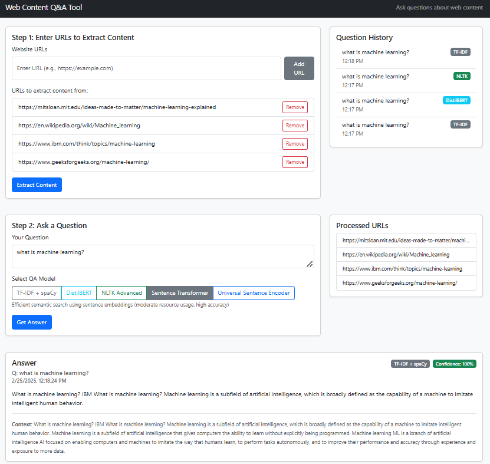

# Web Content Q&A Tool

A web-based tool that allows users to enter one or more URLs, extract content from those pages, and ask questions based on the extracted information. The tool provides concise, accurate answers using only the ingested content.



## Features

- **URL Content Extraction**: Extract and process content from multiple web pages
- **Natural Language Question Answering**: Get answers based solely on the extracted content
- **Multiple Model Support**: Choose from different NLP models based on your needs:
  - TF-IDF + spaCy (Lightweight, default)
  - NLTK Advanced
  - Sentence Transformer
  - TensorFlow
  - DistilBERT (Most accurate, requires more resources)
- **Confidence Scoring**: See how confident the model is in its answers
- **Question History**: Keep track of previous questions during your session
- **User-Friendly Interface**: Clean, intuitive UI built with React and Bootstrap

## Technologies Used

### Backend
- **Flask**: Python web framework
- **BeautifulSoup & html2text**: Web scraping and content extraction
- **NLTK & spaCy**: Natural language processing
- **scikit-learn**: Machine learning algorithms
- **Sentence Transformers**: Semantic search capabilities
- **TensorFlow/PyTorch**: Deep learning (optional)

### Frontend
- **React**: UI library for building the interface
- **Bootstrap**: Responsive design framework
- **Axios**: API requests handling

## Installation

### Prerequisites
- Python 3.8+
- Node.js and npm
- Git

### Setup

1. **Clone the repository**
   ```bash
   git clone https://github.com/yourusername/web-content-qa-tool.git
   cd web-content-qa-tool
   ```

2. **Set up the backend**
   ```bash
   # Create and activate a virtual environment
   python -m venv venv
   # On Windows
   venv\Scripts\activate
   # On macOS/Linux
   source venv/bin/activate

   # Install dependencies
   pip install -r backend/requirements.txt

   # Download spaCy model
   python -m spacy download en_core_web_md
   ```

3. **Set up the frontend**
   ```bash
   cd frontend
   npm install
   ```

### Additional Models (Optional)

For the more advanced models, additional steps may be required:

- **Sentence Transformer**:
  Already included in the basic requirements.

- **DistilBERT**:
  ```bash
  pip install torch transformers
  ```

## Usage

1. **Start the backend server**
   ```bash
   # From the project root directory
   python app.py
   ```

2. **Start the frontend development server**
   ```bash
   # In a new terminal, from the frontend directory
   cd frontend
   npm start
   ```

3. **Access the application**
   Open your browser and navigate to `http://localhost:3000`

4. **Using the application**
   - Enter one or more URLs in the URL input field
   - Click "Extract Content" to process the web pages
   - Once content is extracted, enter your question
   - Select a QA model (optional)
   - Click "Get Answer"
   - View the answer along with its confidence score

## Project Structure

```
web-content-qa-tool/
├── backend/
│   ├── services/                     
│   │   ├── __init__.py
│   │   ├── extractor.py               # URL content extraction
│   │   ├── processor.py               # Content processing
│   │   ├── qa_model.py                # Base QA model (TF-IDF + spaCy)
│   │   ├── qa_model_nltk.py           # NLTK-based model
│   │   ├── qa_model_sentence_transformer.py  # Sentence Transformer model
│   │   ├── qa_model_tensorflow.py     # TensorFlow-based model
│   │   └── qa_model_distilbert.py     # DistilBERT model
│   └── requirements.txt               # Python dependencies
│   
├── frontend/                          
│   ├── public/
│   ├── src/
│   │   ├── components/
│   │   │   ├── Header.jsx
│   │   │   ├── UrlInput.jsx
│   │   │   ├── QuestionInput.jsx
│   │   │   ├── QuestionHistory.jsx
│   │   │   └── Answer.jsx
│   │   ├── services/
│   │   │   └── api.js
│   │   ├── styles/
│   │   │   └── App.css
│   │   ├── App.jsx
│   │   └── index.js
│   ├── package.json
│   └── package-lock.json
│   
├── tests/
│   └── test_distilbert.py
│
├── .gitignore
├── app.py                            # Main Flask application
└── LICENSE                           # MIT License
```

## Model Comparison

| Model | Speed | Accuracy | Resource Usage | Best For |
|-------|-------|----------|----------------|----------|
| TF-IDF + spaCy | ⚡⚡⚡⚡⚡ | ⭐⭐⭐ | 🔋 | Quick answers, basic factual questions |
| NLTK Advanced | ⚡⚡⚡⚡ | ⭐⭐⭐ | 🔋 | Natural language analysis |
| Sentence Transformer | ⚡⚡⚡ | ⭐⭐⭐⭐ | 🔋🔋 | Semantic search, similar meaning questions |
| TensorFlow | ⚡⚡ | ⭐⭐⭐⭐ | 🔋🔋🔋 | Complex questions, better understanding |
| DistilBERT | ⚡ | ⭐⭐⭐⭐⭐ | 🔋🔋🔋🔋 | Highest accuracy, contextual understanding |

## Limitations

- The tool only processes text content from websites
- Some websites may block web scraping attempts
- Performance depends on the quality of extracted content
- Advanced models require more system resources
- The tool cannot answer questions based on information not present in the extracted content

## Troubleshooting

- **Content extraction fails**: Some websites block scraping or have complex layouts
- **Model not available**: Check that you've installed the required dependencies
- **Slow performance**: Try using a lighter model or processing fewer URLs
- **CORS errors**: Ensure both frontend and backend are running

## License

This project is licensed under the MIT License - see the [LICENSE](LICENSE) file for details.